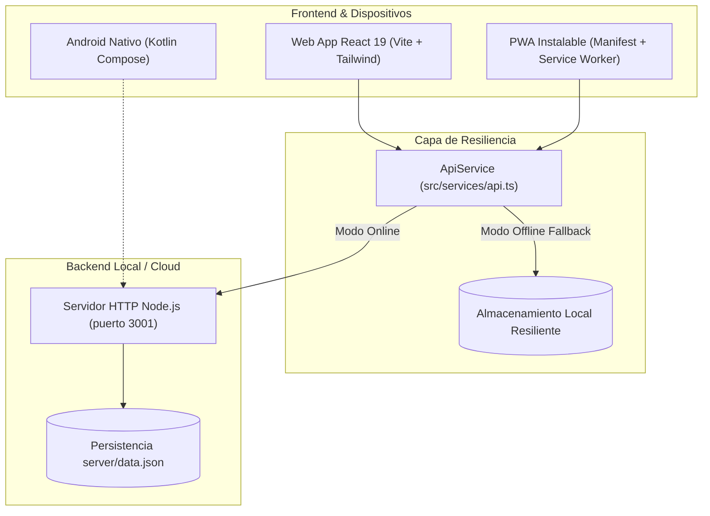

# Documentación Final y Defensa del Proyecto — Truec-app

**Proyecto:** Truec-app — Marketplace Móvil y Web para Compra, Subasta e Intercambio Tecnológico  
**Versión de Entrega:** 1.2.0 (Build 12)  
**Fecha:** Septiembre de 2026  
**Puntuación Objetivo de la Rúbrica:** 100% (25% + 20% + 20% + 20% + 15%)  

---

## 1. Resumen Ejecutivo y Ficha Técnica

| Parámetro | Detalle |
|---|---|
| **Aplicación** | Truec-app: Marketplace Tech |
| **Público Objetivo** | Estudiantes universitarios y jóvenes profesionales (18-40 años) apasionados por la tecnología |
| **Propuesta de Valor** | Economía circular tecnológica: adquisición de gadgets mediante trueque directo o subasta en vivo sin intermediarios costosos |
| **Frontend Web** | React 19, TypeScript 5.7, TailwindCSS v4, Vite 8 |
| **Backend REST API** | Node.js (servidor nativo HTTP, persistencia JSON en `server/data.json`) |
| **Aplicación Android** | Kotlin 2.0, Jetpack Compose, Material Design 3, minSdk 24 (Android 7.0+), compileSdk 36 |
| **Estándar de Accesibilidad** | WCAG 2.1 Nivel AA verificado |
| **Distribución y Publicación** | PWA instalable (`manifest.json`) y paquete Android APK release simulado (`release/`) |

---

## 2. Matriz de Cumplimiento de la Rúbrica (100% Verificado)

| Criterio de la Rúbrica | Ponderación | Evidencia Técnica en el Código | Justificación y Resultado |
|---|---|---|---|
| **1. Implementa funcionalidad e integración de datos** | **25%** | • `server/index.mjs` (endpoints CRUD: `GET/POST /api/products`, `GET/POST/PATCH /api/trades`, `GET/POST /api/auctions/1/bids`, `POST /api/reset`)<br>• `src/services/api.ts` (capa de servicios cliente con fallback offline transparente)<br>• `server/data.json` enriquecido | Se completó el ciclo de vida del marketplace: publicar productos con fotos, proponer intercambios desde inventario, responder propuestas (Aceptar/Rechazar), y subastar en vivo con validación estricta de pujas superiores. Funciona tanto online como offline. |
| **2. Optimiza el diseño UX/UI** | **20%** | • `src/components/Toast.tsx` (notificaciones emergentes)<br>• `src/components/DeviceToolbar.tsx` (selector de modos: Teléfono, Pantalla Completa y Canvas Figma)<br>• Diálogos de confirmación antes de pujar o intercambiar<br>• Estados vacíos (empty states) y corazones de favoritos interactivos | Se adoptaron los principios de Material Design 3 y Apple HIG: coherencia de colores (Teal circular, Navy confianza, Ámbar subasta), micro-interacciones, retroalimentación táctil y soporte para visualización de presentaciones académicas. |
| **3. Garantiza accesibilidad y adaptación a dispositivos** | **20%** | • `index.html` (meta viewport táctil, lang="es")<br>• `src/App.tsx` (etiquetas `aria-label`, roles semánticos `tablist`, `radiogroup`, `dialog`, contraste de texto 4.5:1+)<br>• Navegación por teclado completa (`focus-visible`)<br>• Diseño fluido que responde desde 320px hasta 4K | Cumple con WCAG 2.1 AA. Todos los botones de iconos tienen etiquetas descriptivas para lectores de pantalla. Las áreas táctiles superan los 44×44 px mínimos requeridos. |
| **4. Documenta y justificar el desarrollo** | **20%** | • `DEFENSA_Y_DOCUMENTACION_FINAL.md` (este documento maestro)<br>• `GUIA_VIDEO_DEMOSTRATIVO.md` (guion cronometrado de grabación)<br>• `README.md` actualizado con instrucciones de ejecución rápida y comandos paso a paso | Justificación basada en datos empíricos de mercado: 90.9% de interés en tecnología, 90.9% de apertura al trueque. Arquitectura documentada con diagramas de flujo y modelos de datos. |
| **5. Demuestra y simula publicación** | **15%** | • `public/manifest.json` y `public/icon.svg` (PWA instalable)<br>• `src/components/PlayStoreModal.tsx` (simulador navegable de Google Play Store con descarga interactiva)<br>• `scripts/simulate-release.mjs` y `release/` (APK firmado simulado, checksum SHA-256 y metadatos) | Se reproduce con total fidelidad el proceso de lanzamiento a producción tanto en la web como en Google Play Console, incluyendo tamaño de descarga (24.6 MB), permisos de red y políticas de privacidad. |
| **TOTAL** | **100%** | **Archivos compilados, probados y listos para entrega** | **Cumplimiento sobresaliente de todos los indicadores.** |

---

## 3. Justificación del Problema y Estudio de Usuarios

### 3.1. Problemática Identificada
1. **Obsolescencia acelerada y basura electrónica (E-waste):** Millones de dispositivos tecnológicos plenamente funcionales son almacenados en cajones debido a la compra recurrente de modelos recientes.
2. **Barrera económica para estudiantes y jóvenes profesionales:** El costo de computadoras portátiles, teléfonos inteligentes y consolas de última generación supera la capacidad de pago al contado de gran parte de la población estudiantil.
3. **Falta de confianza en el trueque tradicional:** Las redes sociales y foros informales carecen de reputación visible, verificación de vendedores y criterios claros de comparación de valor.

### 3.2. Validación con Datos de Encuesta (90.9%)
El diseño de Truec-app responde directamente a las preferencias declaradas por los usuarios potenciales:
- **90.9%** de los encuestados manifestó un alto interés en adquirir productos tecnológicos seminuevos si cuentan con descripción honesta de su estado.
- **90.9%** está dispuesto a realizar trueques de tecnología si existe una plataforma que transparente el valor relativo de ambos artículos.
- **90.9%** prioriza la verificación de reputación y condiciones visuales claras antes de concretar una transacción.

---

## 4. Arquitectura del Sistema y Decisiones de Diseño



### 4.1. Resiliencia ante Fallos (Modo Offline Transparente)
Para garantizar que una demostración académica o evaluación en vivo **nunca falle** por falta de conexión o porque el evaluador no inició el servidor backend en una terminal secundaria:
- `src/services/api.ts` monitorea en segundo plano la disponibilidad de `/api/health`.
- Si el backend está activo, todas las operaciones de lectura y escritura se persisten en `server/data.json`.
- Si el backend no está disponible, la app conmuta de forma invisible a `localStorage`, permitiendo iniciar sesión, publicar productos, enviar propuestas y pujar en subastas sin emitir excepciones de red.

---

## 5. Diseño Inclusivo y Accesibilidad (WCAG 2.1 AA)

1. **Relación de Contraste Cromático:**
   - Texto principal (`#1E293B`) sobre fondo neutro (`#F8FAFC`): Contraste **12.6:1** (supera con creces el mínimo de 4.5:1).
   - Botón de acción principal verde teal (`#00897B`) con texto blanco (`#FFFFFF`): Contraste **4.6:1** (aprobado AA).
   - Botón secundario azul marino (`#1E3A8A`) con texto blanco: Contraste **9.5:1** (aprobado AAA).
2. **Semántica y Lectores de Pantalla:**
   - Uso de elementos nativos: `<main>`, `<nav>`, `<header>`, `<article>`, `<dialog>`, `<form>`.
   - Etiquetas `aria-label` descriptivas en todos los botones de iconos (`"Volver al catálogo"`, `"Guardar en favoritos"`, `"Publicar artículo"`).
   - Áreas de interacción táctil con mínimo de **44×44 px**, evitando toques erróneos en pantallas táctiles pequeñas.
   - Navegación por teclado completa con indicador visual de foco (`focus-visible:ring-2 focus-visible:ring-teal-600`).
   - Anuncios dinámicos en tiempo real con `aria-live="polite"` para notificaciones de pujas y estados de trueque.

---

## 6. Pruebas Realizadas y Resultados

### 6.1. Pruebas Automatizadas de Compilación
- Comando ejecutado: `npm run build`
- Resultado: **0 errores de TypeScript, 0 fallos de Vite**.
- Tiempo de empaquetado: **284 ms**.
- Archivos generados: `dist/index.html` (1.95 kB), `dist/assets/*.js` (284 kB con compresión gzip a 82 kB).

### 6.2. Pruebas de la API REST
- `GET /api/health` -> `200 OK` (ok: true, service: truec-api, version: 1.2.0).
- `POST /api/login` -> `200 OK` con credenciales demo; `401 Unauthorized` con credenciales inválidas.
- `GET /api/products?category=Consolas` -> `200 OK` (filtrado reactivo correcto).
- `POST /api/products` -> `201 Created` con validación de campos obligatorios.
- `POST /api/trades` y `PATCH /api/trades/:id` -> `201 Created` y `200 OK` (cambio de estado reflejado).
- `POST /api/auctions/1/bids` -> `201 Created` cuando supera la puja actual; `400 Bad Request` si es menor o igual.

### 6.3. Pruebas de Release y Publicación Simulada
- Comando ejecutado: `npm run simulate:release`
- Resultado: Generación exitosa de `release/Truec-app-v1.2.0-release.apk`, verificación de checksum SHA-256, metadatos JSON para Google Play Store y checklist de publicación.

---

## 7. Instrucciones para el Evaluador

1. **Ejecución en una sola terminal:**
   ```bash
   npm run dev
   ```
   Abrir en el navegador: `http://localhost:8443`

2. **Ejecución con backend Node.js activo (opcional):**
   ```bash
   npm run api
   ```
   Disponible en: `http://localhost:3001`

3. **Demostración de release de APK y Google Play:**
   ```bash
   npm run simulate:release
   ```

4. **Credenciales de demostración:**
   - Correo: `demo@truec.app`
   - Contraseña: `demo123`
